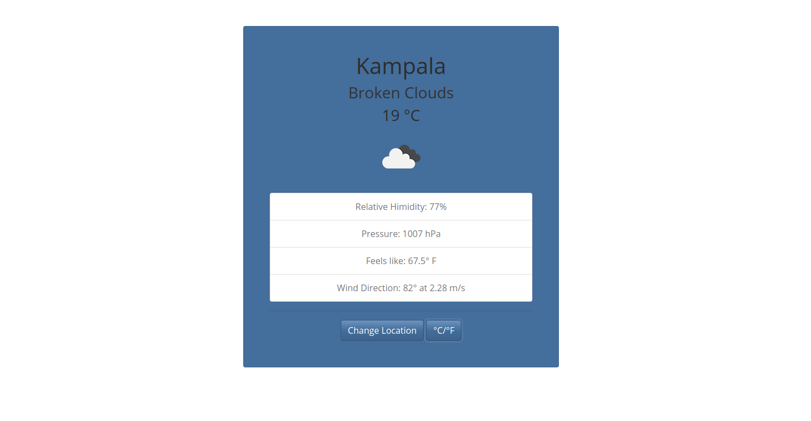

# JS-Weather-app

> This is a JS Weather app where users can search for current weather conditions of a given city.

## Built With

- JavaScript, HTML & CSS
- Bootstrap
- Openweather API
- Webpack
- npm

## Live Demo

[Live Demo Link](https://trekabs-js-weather-app.netlify.app/)

## Getting Started

To get a local copy up and running follow these simple example steps.
- run `git clone git@github.com:trekab/js-weather-app.git` in the terminal

Navigate to the root directory
- `cd js-weather-app`

Run npm install to ensure all the needed packages and dependencies are installed:
- `$ npm install`

Build the app, running npm run build
- `$ npm run build`

Navigate to the dist directory and open the `index.html` from your preferred browser

## Authors

👤 **Treasure Kabareebe**

- Github: [@trekab](https://github.com/trekab)
- Twitter: [@TKabareebe](https://twitter.com/TKabareebe)
- Linkedin: [Treasure Kabareebe](https://www.linkedin.com/in/treasure-kabareebe/)

## 🤝 Contributing

Contributions, issues and feature requests are welcome!

Feel free to check the [issues page](issues/).

## Show your support

Give a ⭐️ if you like this project!

## 📝 License

This project is [MIT](lic.url) licensed.
